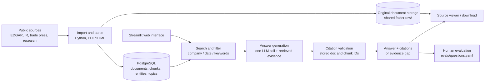

# Architecture

Draft for week 1. Invariants are in [CLAUDE.md, Architecture invariants](../CLAUDE.md#architecture-invariants);
this file explains the design behind them. Decisions are recorded in [DECISIONS.md](DECISIONS.md).

## Pipeline



## Schema draft

Sketch only; no migration files yet (the tech lead writes them in plans/0001).

```sql
CREATE TABLE entities (
  entity_id     text PRIMARY KEY,          -- MS, SCHW, EDJ, MER, BAC, RJF (config/entities.yaml)
  name          text NOT NULL,
  parent_id     text REFERENCES entities,  -- MER -> BAC
  reported_as   text,                      -- MER -> GWIM
  equivalence   text,                      -- 'full' | 'partial'
  caveat        text                       -- inserted by code when a substitute is used
);

CREATE TABLE documents (
  doc_id        text PRIMARY KEY,          -- stable, e.g. BAC-10K-2025
  entity_id     text NULL REFERENCES entities, -- NULL for thematic research
  doc_type      text NOT NULL,             -- 10-K, 10-Q, 8-K, transcript, deck, supplement, press, trade, research, adv
  source_tier   int  NOT NULL,             -- 1..6, see Source tiers below
  published_at  date NOT NULL,             -- required: recency and time windows depend on it
  period_end    date,
  url           text,
  storage_path  text NOT NULL,             -- raw/<entity>/<doc_id>.<ext> in the shared folder
  sha256        text NOT NULL
);

CREATE TABLE chunks (
  chunk_id      text PRIMARY KEY,          -- '<doc_id>#<n>'
  doc_id        text NOT NULL REFERENCES documents,
  section       text,                      -- chunks never cross a section
  segment       text NULL,                 -- e.g. GWIM, tagged at chunking time
  page          int,                       -- PDFs only
  text          text NOT NULL,             -- includes the context prefix
  tsv           tsvector GENERATED ALWAYS AS (to_tsvector('english', text)) STORED,
  embedding     vector NULL                -- unused until ADR-001 is revisited
);
CREATE INDEX ON chunks USING gin (tsv);

CREATE TABLE topics       (topic_id text PRIMARY KEY, label text, parent_id text);
CREATE TABLE chunk_topics (chunk_id text REFERENCES chunks, topic_id text REFERENCES topics,
                           PRIMARY KEY (chunk_id, topic_id));

CREATE TABLE source_registry (            -- what SHOULD exist per entity
  entity_id text, doc_type text, source_name text, url_pattern text, expected_cadence text,
  PRIMARY KEY (entity_id, doc_type, source_name)
);

CREATE TABLE query_log      (query_id serial PRIMARY KEY, asked_at timestamptz, question text,
                             mode text, filters jsonb, chunk_ids text[], answer jsonb,
                             snapshot text, model text);
CREATE TABLE query_feedback (query_id int REFERENCES query_log, rating int, comment text,
                             created_at timestamptz);
```

## Segment-level hard filter (the Merrill case)

Merrill does not file on its own; it lives inside Bank of America's GWIM segment, which also
contains Bank of America Private Bank. If retrieval returns any BAC chunk, the model will
happily present BAC consumer-bank hiring as "Merrill strategy" and it will read well (Q4, Q27).

So segment is tagged on each chunk when the document is chunked (C1 owns the tagging rules),
and retrieval filters on it in SQL:

```sql
-- Merrill question: only these chunks are eligible
WHERE d.entity_id = 'MER'
   OR (d.entity_id = 'BAC' AND c.segment IN ('GWIM', 'Merrill'))
```

The citation label then reads "BAC 10-K - GWIM segment", never "Merrill 10-K".

## Retrieval modes

Chosen by deterministic rules (entity/theme matching against `config/entities.yaml` and the
topics list), not by the LLM. Details in [specs/retrieval.md](../specs/retrieval.md).

| Mode | When | Filter | Quota |
|---|---|---|---|
| `entity` | Question names one or more firms | entity + segment hard filter | per entity |
| `theme` | No firm named, theme matched (Q16, Q18, Q20) | topic filter; research docs eligible | per topic |
| `entity+theme` | Both (Q12, Q21) | both parts retrieved separately | split between parts |

## Entity relation model

In `config/entities.yaml`:

- `parent`: MER's parent is BAC.
- `reported_as`: MER is reported as BAC segment GWIM.
- `equivalence: partial`: the reported segment is related but not the same thing.
- `caveat`: text that **code** appends whenever an answer uses substitute data, e.g.
  "GWIM is not Merrill: the segment also includes Bank of America Private Bank." (Q30)

## Chunking

- Three levels: cover / section / paragraph. A chunk never crosses a section boundary.
- PDFs keep the page number on every chunk (needed for the source viewer).
- Each chunk text starts with a template prefix, built by code, no LLM:
  `[entity|segment|doc_type|period]`, e.g. `[BAC|GWIM|10-K|2025-12-31]`.
  This follows Anthropic's
  [Contextual Retrieval](https://www.anthropic.com/news/contextual-retrieval): prepending
  context to each chunk improves retrieval; we use a cheap deterministic version.
- Data layers: `data/raw` -> `data/interim` -> `data/processed`, with `data/manifest.csv`
  so ingestion can resume where it stopped.

## Answer JSON

One LLM call returns this shape (Claude via tool use, OpenAI via Structured Outputs); our
code validates it. See [specs/answer-citations.md](../specs/answer-citations.md).

```json
{
  "answerable": true,
  "behavior": "answer | answer_with_boundary | gap_with_adjacent | refuse",
  "claims":   [{"text": "...", "chunk_ids": ["MS-TR-2025Q2#14"], "source_label": "MS earnings call 2025-07-16"}],
  "adjacent": [{"text": "...", "chunk_ids": ["..."], "differs_because": "net headcount change is not attrition"}],
  "gaps":     [{"what": "...", "suggested_source": "..."}],
  "caveats":  ["inserted by code"]
}
```

## Source tier labels

Every citation shows its tier label: tier 1 `licensed`, 2 `filing`, 3 `IR`,
4 `trade press (indicative only)`, 5 `research`, 6 `signal`.

## Shared corpus flow (ADR-006)

1. Raw files live in the team's WashU OneDrive/Box folder as `raw/<entity>/<doc_id>.<ext>`.
2. `data/manifest.csv` (one row per document) is in git.
3. Corpus owners debug ingestion locally; changes land via PR.
4. Weekly, the tech lead rebuilds the database from `main` and publishes
   `snapshots/corpus-YYYY-MM-DD.dump` to the shared folder.
5. Everyone runs one `restore` command to load it into local Docker Postgres. Scores record
   the snapshot name.

## Reference projects by module

From the team's OSS research. None is copied whole; together they cover roughly 70% of the design.

| Module | Main reference | Secondary |
|---|---|---|
| Layout, env, collaboration | [bt4103-team8-sec-filing-assistant](https://github.com/niclow236/bt4103-team8-sec-filing-assistant) (layout, git rules), [earnings-intelligence](https://github.com/arnenyeck06/earnings-intelligence) (Docker Compose) | [Grounded-Rag-Analyst](https://github.com/Monesh76/Grounded-Rag-Analyst) (decision records) |
| Acquisition | [edgartools](https://github.com/dgunning/edgartools), [edgar-crawler](https://github.com/lefterisloukas/edgar-crawler); bt4103 resumable pipeline | - |
| Parsing and chunking | [sec_rag_assistant](https://github.com/lazfa04/sec_rag_assistant) (3-level chunks, pitfalls), bt4103 (no cross-section chunks) | [agentic-sec-rag](https://github.com/mr-j90/agentic-sec-rag) (chunk prefix), [Financial-Filings-RAG](https://github.com/AshishBhalala11/Financial-Filings-RAG) (page numbers) |
| Storage | Grounded-Rag-Analyst schema (tsvector first) | bt4103 data layers |
| Entity resolution and filters | agentic-sec-rag (deterministic resolution), sec_rag_assistant (retrieval-layer filter, per-entity quotas) | Own design: segments |
| Retrieval | Postgres FTS first; later Grounded-Rag-Analyst RRF | [rag-pipeline-sec-filings](https://github.com/avivakahlon/rag-pipeline-sec-filings) (dedupe), [sec-edgar-rag](https://github.com/ankankisku-lab/sec-edgar-rag) (sub-questions) |
| Generation and citations | bt4103 (Pydantic templates), Grounded-Rag-Analyst (citation validator) | agentic-sec-rag (single LLM call) |
| Evidence gaps | agentic-sec-rag (coverage note), Grounded-Rag-Analyst (insufficient-evidence gate) | Own design: source registry |
| Front end | earnings-intelligence (Streamlit + feedback) | [sec-insights](https://github.com/run-llama/sec-insights) (highlight cited text) |
| Evaluation | earnings-intelligence (logs, feedback), bt4103 (review UI) | Grounded-Rag-Analyst (two-layer eval), rag-pipeline-sec-filings (LLM judge) |

Own design (no project to copy): non-SEC sources, theme index, segment attribution,
"which source would fill the gap".
